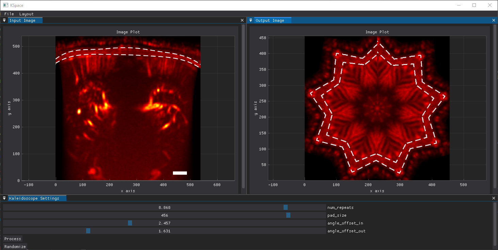
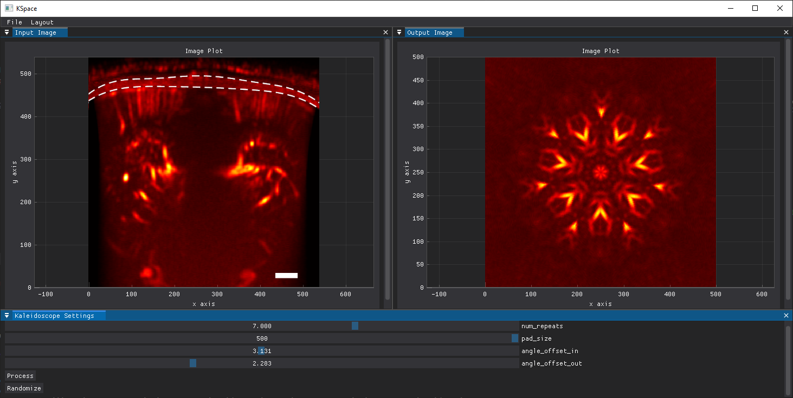

# Kaleidoscopy

A fun and interactive Kaleidoscope App built with Python! This app transforms your images into mesmerizing kaleidoscopic patterns, letting you explore endless visual designs. Whether you're playing with photos or creating digital art, this app delivers vibrant and dynamic experiences.

This app is powered by the following Python libraries:

- Dear PyGui: For creating an intuitive and interactive GUI.
- OpenCV (cv2): For image processing and manipulation.
- SciPy: For scientific computations and transformations.
- NumPy: For efficient numerical operations.
- Matplotlib: For rendering and visualizing the kaleidoscopic patterns in jupiter notebooks

## GUI
An interactive GUI, reasonably interactive, to play around with some parameters.
Data on display is an ultrafast plane wave transcranial power Doppler image of a mouse brain. 

# References

- https://github.com/timbz/KaleidoscopeGenerator
- https://github.com/Kazuhito00/Image-Processing-Node-Editor